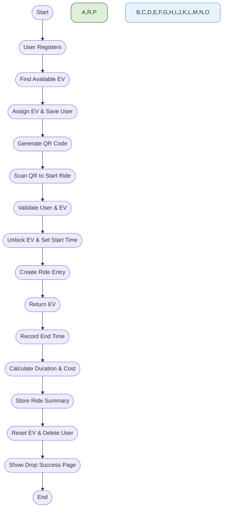

# ⚡ EV Rental System (Flask + MongoDB)

This is a simple, full-stack electric vehicle (EV) rental system built using **Flask** (Python backend), **MongoDB** (via PyMongo), and **HTML templates**. It simulates the lifecycle of renting, unlocking, and dropping an EV, complete with QR code generation, user management, and ride cost tracking.

---

## 🚀 Features

- 📋 **User Registration** — Users register with their name and phone number.
- 🔐 **EV Assignment & QR Code** — Automatically assigns an available EV and generates a scannable QR code.
- 🔓 **Unlock via Scanning** — Users scan their EV tag to start the ride.
- ⏱️ **Ride Time Tracking** — Tracks ride start and end time in real time.
- 💵 **Cost Calculation** — Dynamically calculates total cost based on ride duration.
- 🧾 **Ride Summary** — Stores ride details and billing history.
- 🗑️ **User Cleanup** — Deletes user data after ride completion.

---

## 🛠️ Tech Stack

| Layer         | Technology            |
|--------------|------------------------|
| Backend       | Flask (Python)         |
| Database      | MongoDB (via PyMongo)  |
| Frontend      | HTML + Jinja2 Templates|
| QR Generation | `qrcode`, `base64`     |

---

## 📂 Project Structure

```
ev-rental-app/
│
├── templates/
│   ├── index.html
│   ├── register.html
│   ├── profile.html
│   ├── scan.html
│   ├── drop_vehicle.html
│   └── drop_success.html
│
├── app.py          # Main Flask backend
├── requirements.txt
└── README.md
```
---

## 🔧 Setup Instructions

1. **Clone the Repository**

   ```bash
   git clone https://github.com/your-username/ev-rental-system.git
   cd ev-rental-system
   ```

2. **Install Dependencies**

   Create a virtual environment (optional):

   ```bash
   python -m venv venv
   source venv/bin/activate  # On Windows: venv\Scripts\activate
   ```

   Install required packages:

   ```bash
   pip install -r requirements.txt
   ```

3. **Start MongoDB**

   Make sure your local MongoDB is running:

   ```bash
   mongod --dbpath /path/to/your/db
   ```

4. **Run the App**

   ```bash
   python app.py
   ```

   Open in your browser: [http://localhost:5000](http://localhost:5000)

---

## 🧪 Key Endpoints

| Route              | Description                          |
|-------------------|--------------------------------------|
| `/`               | Home Page                            |
| `/register`       | User Registration & EV Assignment    |
| `/scan`           | Start a Ride (Unlock EV)             |
| `/return_ev`      | Drop Page                            |
| `/drop_vehicle`   | Finalize Ride, Cost, and Clean-up    |

---

## 📌 Ride Cost Logic

- Rate: `₹50` per hour (`COST_PER_HOUR`)
- Time is measured using UTC timestamps
- Total cost is shown after returning the EV

---

## 📦 MongoDB Collections

- `users`: Active registered users
- `ev`: Electric vehicle data (status, assigned, locked)
- `rides`: Current and past ride sessions
- `ride_summary`: Final billing + ride history

---

## 📸 Screenshots (Optional)

> Add screenshots of:
> - Registration page
> - QR code display
> - Scan and unlock flow
> - Ride summary message

---

## ✨ Future Improvements

- Admin dashboard to monitor rides
- User login & session management
- Real-time EV tracking on map
- Payment gateway integration

---

## 🤝 Contributing

Pull requests are welcome! Please fork and submit a PR. For major changes, open an issue first.

---

## 📄 License

This project is licensed under the MIT License.

---

## 👤 Author

**Jay**
